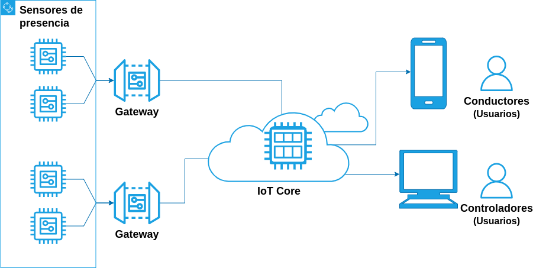

# Ejercicio CiberKillChain - Ataque

Alumno: Luis Gabriel Rueda Yarlequé

## Sistema víctima

El sistema víctima es un sistema de estacionamiento itinerario inteligente, el cual mejorar la gestión de estacionamientos en la ciudad Lima, utilizando tecnología IoT, sensores de ultrasonido, nodos de comunicación ESP32 y una plataforma en la nube de AWS para proporcionar información en tiempo real sobre la disponibilidad de estacionamientos y gestionar los límites de tiempo de estacionamiento. 

El objetivo principal es facilitar la vida de los conductores en la ciudad, al ayudarles a encontrar estacionamientos disponibles de manera más eficiente y evitar multas por exceder los límites de tiempo permitido.

## Cyberkillchain

Armar una cyberkillchain usando técnicas de la matriz de Att&ck para un escenario relacionado al trabajo práctico de la carrera.

### Objetivo del ataque

El atacante es una organización criminal que antes de la implementación de este sistema de estacionamiento itinerario inteligente controlaban los estacionamientos, cobrando a los usuarios por el uso de los estacionamientos y el cuidado de los automoviles; cuando se implemento el sistema de estacionamiento itinerario se puso mas seguridad en los estacionamientos, por lo cual, ya no pueden operar.

El atacante se ha asesorado y busca sabotear el sistema de estacionamiento itinerario, modificando la información que llega a la nube con la finalidad de que los usuarios vean inutil el sistema (No se brinde el estatus correcto de los estacionamientos o se multen a usuarios injustamente) y a traves de reclamos se de la baja del sistema y los estacionamientos se continuen manejando por esta organización criminal.

### Ataque

* Reconnaissance
  - Recopilar información sobre los componentes, protocolos de comunicación, IPs y flujo de datos del sistema. [T1592 - Gather Victim Host Information](https://attack.mitre.org/techniques/T1592/)
  - Recopilar información sobre la arquitectura del sistema. [T1590 - Gather Victim Network Information](https://attack.mitre.org/techniques/T1590/)

* Weaponization
  - Desarrollar un exploit para explotar las vulnerabilidades de los principales browsers y adquirir credenciales de la sesión. [T1587.004 - Develop Capabilities: Exploit](https://attack.mitre.org/techniques/T1587/004/)
  - Desarrollar un malware para interceptar y modificar los datos enviados por los nodos ESP32 al servidor IoT. [T1587.001 - Develop Capabilities: Malware](https://attack.mitre.org/techniques/T1587/001/)
  - Elaborar un link malicioso para capturar credenciales del browser. [T1608.005 - Stage Capabilities: Link Target](https://attack.mitre.org/techniques/T1608/005/)

* Delivery
  - Lanzar campañas de phishing la organización con el link. [T1566.002 - Phishing: Spearphing Link](https://attack.mitre.org/techniques/T1566/002/)
  - El usuario mediante un correo electrónico es convencido de hacer click en el link. [T1204.001 - User Execution: Malicious Link](https://attack.mitre.org/techniques/T1204/001/)

* Exploit
  - Se explotan las vulnerabilidades del browser del usuario para adquirir credenciales, se buscan credenciales al servidor IoT. [T1212 - Exploitation for Credential Access](https://attack.mitre.org/techniques/T1212/)

* Installation
  - En el servidor IoT se crea un servicio que ejecute el malware que modifica los datos enviados por los nodos ESP32. [T1543.002 - Create or Modify System Process: Systemd Service](https://attack.mitre.org/techniques/T1543/002/)

* Command & Control
  - Establecer un canal de comunicación encubierto, modificando el DNS del sistema, con lo cual el trafico de comunicación parecerá un trafico esperado. [T1071.004 - Applicacion Layer Protocol: DNS](https://attack.mitre.org/techniques/T1071/004/)
  - Utilizar técnicas para ocultar la IP y geolocalización del atacante, entregando otra información en la comunicacion con el sistema de la victima. [T1665 - Hide Infrastructure](https://attack.mitre.org/techniques/T1665/)

* Actions on Objectives
  - Eliminar los servicios relacionados a la recuperación del sistema y accesos a backups, para que el sistema no pueda ser reestablecido [T1490 - Inhibit System Recovery](https://attack.mitre.org/techniques/T1490/)
  - Inyectar información falsa o engañosa para mostrar estacionamientos disponibles o tiempos límite incorrectos. [T1565.002 - Data Manipulation: Transmitted Data Manipulation](https://attack.mitre.org/techniques/T1565/002/)
  - Eliminar rastros de la actividad maliciosa, como el borrado de registros de eventos o archivos temporales. [T1485 - Data Destruction](https://attack.mitre.org/techniques/T1485/)
